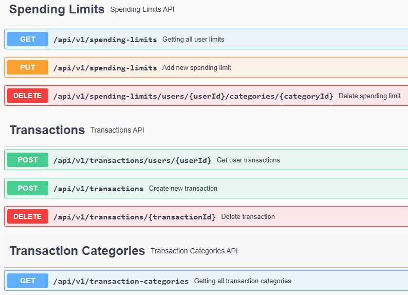
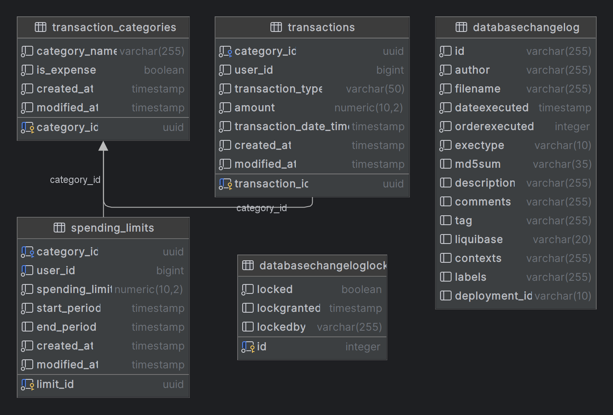

# Financial Helper Application

This project is a **Financial Assistant** designed to help users manage their personal finances. It provides the ability to add transactions, categorize expenses, set spending limits, and receive notifications for overspending. The service also processes receipts from QR codes, breaking down the items into categories and adding them as transactions. The application is built on a reactive stack using modern technologies for high performance and scalability.

## Set up
- [*clone*](https://github.com/HUNT-ER/financial-helper-service.git) the project
- change [application.properties](src/main/resources/application.yaml) file based on your
  configurations
- change [.env](.env) file for docker-compose environment variables
- run [docker-compose.yaml](docker-compose.yaml) with [.env](.env)
- run the project
  using [FinancialHelperApplication.java](src%2Fmain%2Fjava%2Fcom%2Fboldyrev%2Ffinancialhelper%2FFinancialHelperApplication.java)

## Features
1. **Add Transactions (Income and Expenses)**
  - Users can add budget transactions, which include both income and expenses.

2. **QR Code Receipt Scanning**
  - The service scans QR codes from receipts.
  - It categorizes the items and adds them as individual transactions.
  - An HTML receipt is generated and sent to the user via RabbitMQ.

3. **Spending Limits by Category**
  - Users can set spending limits for specific categories over a defined period.
  - When adding a transaction, the service checks if the spending limit is exceeded.
  - If the limit is exceeded, the user is notified via RabbitMQ.

## Technologies Used
- **Spring Boot WebFlux**: Non-blocking API.
- **Postgres R2DBC**: Reactive PostgreSQL database access.
- **MongoDB**: NoSQL database for storing receipts and other unstructured data.
- **RabbitMQ**: Messaging broker for asynchronous communication, such as sending notifications and HTML receipts.
- **Redis**: In-memory data store for caching and token management.
- **Keycloak**: Identity and access management for authentication and authorization.
- **Liquibase**: Database versioning and migrations.
- **ZXing**: Library for reading QR codes from receipts.
- **Thymeleaf**: Template engine for generating HTML receipts.

## API Reference

## Database diagram
